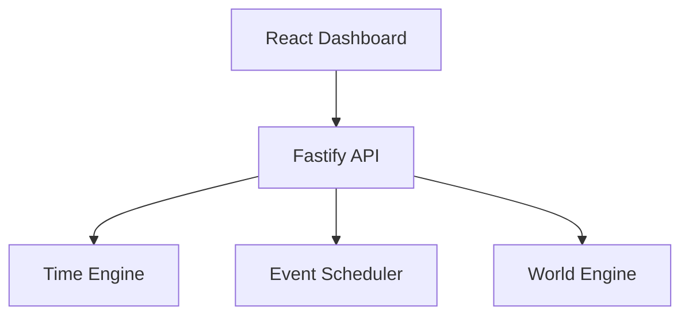
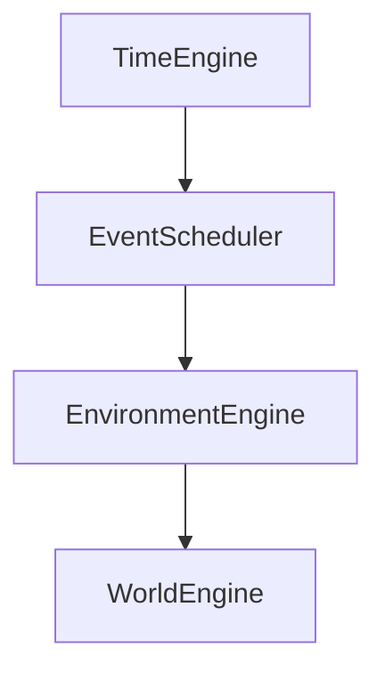
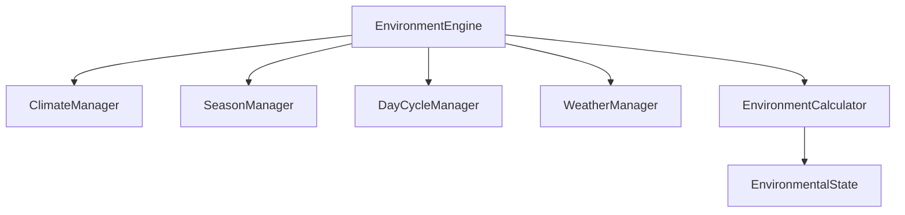
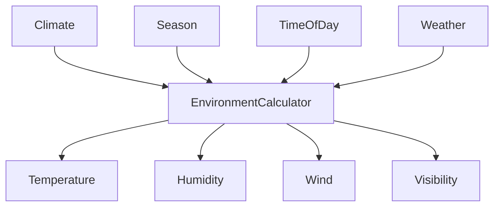
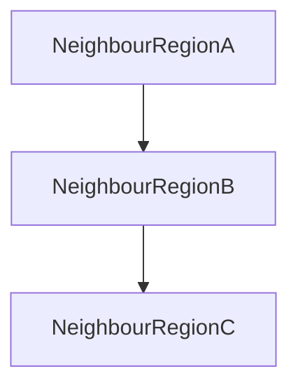

# Project Genesis

**Data first. Visualization second.**

Project Genesis is a modular simulation engine designed to power complex civilization simulations. This repository contains the complete foundational structure, utilizing a clean, scalable architecture independent of the frontend visualization.

## Project Vision

To build a highly decoupled, data-driven simulation engine where backend systems compute the state of the world, and any number of frontends can connect to visualize that state. This phase focuses entirely on establishing the robust monorepo architecture and foundational packages.

## Architecture

This project follows **Clean Architecture** principles:
- **Presentation:** Frontend React Application.
- **Application:** Use cases and orchestration (Backend Services).
- **Domain:** Core business rules (Shared Types/Models).
- **Infrastructure:** Databases, APIs, and External Services (Backend Repositories).

The simulation engine is completely independent from the frontend.

## Folder Structure

```
genesis/
├── packages/
│   └── engine/   # Core simulation engine logic (Time Engine, etc.)
├── frontend/     # React, Vite, Tailwind CSS application
├── backend/      # Node.js, Fastify, Prisma backend API
├── shared/       # Shared TypeScript types, interfaces, constants
├── docs/         # Additional project documentation
├── scripts/      # Automation and CI/CD scripts
└── .github/      # GitHub actions and workflows
```

## Tech Stack

### Frontend
- **Framework:** React + TypeScript + Vite
- **Styling:** Tailwind CSS + shadcn/ui
- **State/Routing:** Zustand, React Router, TanStack Query

### Backend
- **Framework:** Node.js + Fastify + TypeScript
- **Database:** Prisma ORM + SQLite
- **Validation:** Zod
- **Config:** dotenv

### Shared
- **Tooling:** ESLint, Prettier, Husky, lint-staged

## Installation

1. Install dependencies from the root to bootstrap all workspaces:
   ```bash
   npm install
   ```
2. Generate the Prisma Client:
   ```bash
   cd backend
   npx prisma generate
   ```

## Running the Project

### Running Backend
```bash
npm run dev:backend
```
*Runs the Fastify server with hot-reload.*

### Running Frontend
```bash
npm run dev:frontend
```
*Runs the Vite development server.*

### Running Both
```bash
npm run dev
```

## Current Phase Status (Phase 1.2)
- **Completed:** Foundation monorepo structure.
- **Completed:** Time Engine module (`packages/engine`) decoupled from frontend and backend.
- **Completed:** Backend REST API mapping to Time Engine.
- **Completed:** Frontend React Dashboard visualization of Time Engine.

## Future Roadmap

```text
Genesis Roadmap

Phase 1 ✅ Core Engine
├── Project Foundation
├── Time Engine
├── Event Scheduler
└── Engine Inspector

Phase 2 🚧 World Engine
├── 2.1 World Model
├── 2.2 Environment Engine
├── 2.3 Resource Engine
├── 2.4 Spatial Engine
└── 2.5 World Inspector

Phase 3 🔜 Citizen Engine
Phase 4 🔜 AI Decision Engine
Phase 5 🔜 Economy Engine
Phase 6 🔜 Relationship Engine
Phase 7 🔜 History Engine
Phase 8 🔜 Visualization
Phase 9 🔜 Persistence
Phase 10 🔜 Optimization & Scale
```

## Phase 2 – World Engine

The World Engine provides the spatial foundation for every future module in Project Genesis. 

### Responsibilities
- Manages the hierarchical spatial structure of the simulation world.
- Serves as the authoritative source for the location of all simulated entities.
- Provides high-performance spatial queries (e.g. `findNearbyBuildings`, `findNearestEntity`).

### Hierarchy & Spatial Model
The simulation environment is organized into a strictly parented tree structure:
`World` -> `Region` -> `City` -> `District` -> `Building` -> `Room` -> `Object`

Every spatial entity maintains a 2D Cartesian `Coordinate (x, y)` to allow euclidean distance calculations and pathfinding.

### Future Integration
All future engines (Citizen, Weather, Economy, Transportation, AI) will depend on the World Engine to situate their domain entities and resolve spatial interactions.

### Overall Genesis Architecture


## World Initialization

Genesis does not automatically create a simulation world.

On first startup:

1. No active world exists.
2. GET /api/v1/world returns **404 No Active World**.
3. The frontend displays a "Create World" state.
4. The developer creates the world using:

POST /api/v1/world

After creation, the World Engine becomes active and all future modules operate within this world.

This design ensures the simulation lifecycle is explicit and controlled by the engine rather than hidden initialization logic.

## Phase 2.2 – Environment Engine

The Environment Engine adds a robust, data-driven environmental simulation layer to Genesis. It is responsible for simulating realistic environmental conditions across the world's regions independently from other engines.

### Architecture
The Environment Engine comprises independent modules to maintain separation of responsibilities:
- **Climate Manager**: Stores Region "DNA" (Tropical, Temperate, etc.)
- **Season Manager**: Dictates seasons (Spring, Summer, Autumn, Winter) mapped to the Genesis calendar.
- **Day Cycle Manager**: Translates time into day phases (Dawn, Morning, Afternoon, Evening, Night).
- **Weather Manager**: Handles localized weather transitions using weighted probabilities and Markov chains.
- **Environment Calculator**: Dynamically calculates granular values (Temperature, Humidity, Wind, Visibility) based on base climate, season, day phase, weather, and noise.

### Event Integration
The Environment Engine avoids tight polling. Instead, it subscribes to the Event Scheduler (using a recurring hourly event) to update states and emits standard `SimulationEvent`s when seasons, weather, or day phases transition (e.g., Sunrise, Sunset, Season Change).

### Weather Fronts and Spatial Coherence
Adjacent regions influence each other. A storm in one region can bleed into a neighboring sunny region, creating realistic weather fronts moving across the world without relying on pure randomness.

### Mermaid Diagrams

#### Engine Integration


#### Environment Engine Architecture


#### Calculation Flow


#### Spatial Coherence (Weather Propagation)
