# Project Genesis

**Data first. Visualization second.**

Project Genesis is a modular simulation engine designed to power complex civilization simulations. This repository contains the complete foundational structure, utilizing a clean, scalable architecture independent of the frontend visualization.

## Project Vision

To build a highly decoupled, data-driven simulation engine where backend systems compute the state of the world, and any number of frontends can connect to visualize that state. This phase focuses entirely on establishing the robust monorepo architecture and foundational packages.

## Architecture

This project follows **Clean Architecture** principles:
- **Presentation:** Frontend React Application.
- **Application:** Use cases and orchestration (Backend Services).
- **Domain:** Core business rules (Shared Types/Models).
- **Infrastructure:** Databases, APIs, and External Services (Backend Repositories).

The simulation engine is completely independent from the frontend.

## Folder Structure

```
genesis/
├── packages/
│   └── engine/   # Core simulation engine logic (Time Engine, etc.)
├── frontend/     # React, Vite, Tailwind CSS application
├── backend/      # Node.js, Fastify, Prisma backend API
├── shared/       # Shared TypeScript types, interfaces, constants
├── docs/         # Additional project documentation
├── scripts/      # Automation and CI/CD scripts
└── .github/      # GitHub actions and workflows
```

## Tech Stack

### Frontend
- **Framework:** React + TypeScript + Vite
- **Styling:** Tailwind CSS + shadcn/ui
- **State/Routing:** Zustand, React Router, TanStack Query

### Backend
- **Framework:** Node.js + Fastify + TypeScript
- **Database:** Prisma ORM + SQLite
- **Validation:** Zod
- **Config:** dotenv

### Shared
- **Tooling:** ESLint, Prettier, Husky, lint-staged

## Installation

1. Install dependencies from the root to bootstrap all workspaces:
   ```bash
   npm install
   ```
2. Generate the Prisma Client:
   ```bash
   cd backend
   npx prisma generate
   ```

## Running the Project

### Running Backend
```bash
npm run dev:backend
```
*Runs the Fastify server with hot-reload.*

### Running Frontend
```bash
npm run dev:frontend
```
*Runs the Vite development server.*

### Running Both
```bash
npm run dev
```

## Current Phase Status (Phase 1.2)
- **Completed:** Foundation monorepo structure.
- **Completed:** Time Engine module (`packages/engine`) decoupled from frontend and backend.
- **Completed:** Backend REST API mapping to Time Engine.
- **Completed:** Frontend React Dashboard visualization of Time Engine.

## Future Roadmap

```text
Genesis Roadmap

Phase 1 ✅ Core Engine
├── Project Foundation
├── Time Engine
├── Event Scheduler
└── Engine Inspector

Phase 2 🚧 World Engine
├── 2.1 World Model
├── 2.2 Environment Engine
├── 2.3 Resource Engine
├── 2.4 Spatial Engine
└── 2.5 World Inspector

Phase 3 🔜 Citizen Engine
Phase 4 🔜 AI Decision Engine
Phase 5 🔜 Economy Engine
Phase 6 🔜 Relationship Engine
Phase 7 🔜 History Engine
Phase 8 🔜 Visualization
Phase 9 🔜 Persistence
Phase 10 🔜 Optimization & Scale
```

## Phase 2 – World Engine

The World Engine provides the spatial foundation for every future module in Project Genesis. 

### Responsibilities
- Manages the hierarchical spatial structure of the simulation world.
- Serves as the authoritative source for the location of all simulated entities.
- Provides high-performance spatial queries (e.g. `findNearbyBuildings`, `findNearestEntity`).

### Hierarchy & Spatial Model
The simulation environment is organized into a strictly parented tree structure:
`World` -> `Region` -> `City` -> `District` -> `Building` -> `Room` -> `Object`

Every spatial entity maintains a 2D Cartesian `Coordinate (x, y)` to allow euclidean distance calculations and pathfinding.

### Future Integration
All future engines (Citizen, Weather, Economy, Transportation, AI) will depend on the World Engine to situate their domain entities and resolve spatial interactions.

### Overall Genesis Architecture

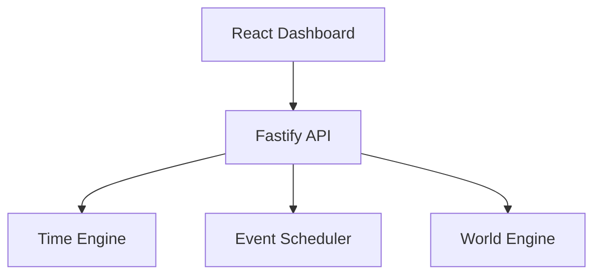
## World Initialization

Genesis does not automatically create a simulation world.

On first startup:

1. No active world exists.
2. GET /api/v1/world returns **404 No Active World**.
3. The frontend displays a "Create World" state.
4. The developer creates the world using:

POST /api/v1/world

After creation, the World Engine becomes active and all future modules operate within this world.

This design ensures the simulation lifecycle is explicit and controlled by the engine rather than hidden initialization logic.

## Phase 2.2 – Environment Engine

The Environment Engine adds a robust, data-driven environmental simulation layer to Genesis. It is responsible for simulating realistic environmental conditions across the world's regions independently from other engines.

### Architecture
The Environment Engine comprises independent modules to maintain separation of responsibilities:
- **Climate Manager**: Stores Region "DNA" (Tropical, Temperate, etc.)
- **Season Manager**: Dictates seasons (Spring, Summer, Autumn, Winter) mapped to the Genesis calendar.
- **Day Cycle Manager**: Translates time into day phases (Dawn, Morning, Afternoon, Evening, Night).
- **Weather Manager**: Handles localized weather transitions using weighted probabilities and Markov chains.
- **Environment Calculator**: Dynamically calculates granular values (Temperature, Humidity, Wind, Visibility) based on base climate, season, day phase, weather, and noise.

### Event Integration
The Environment Engine avoids tight polling. Instead, it subscribes to the Event Scheduler (using a recurring hourly event) to update states and emits standard `SimulationEvent`s when seasons, weather, or day phases transition (e.g., Sunrise, Sunset, Season Change).

### Weather Fronts and Spatial Coherence
Adjacent regions influence each other. A storm in one region can bleed into a neighboring sunny region, creating realistic weather fronts moving across the world without relying on pure randomness.

### Mermaid Diagrams

#### Engine Integration
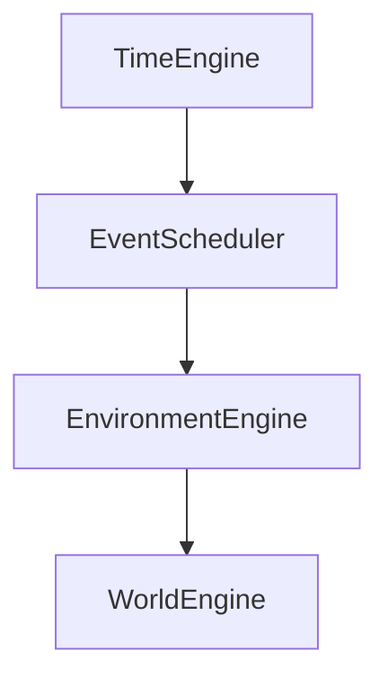

#### Environment Engine Architecture
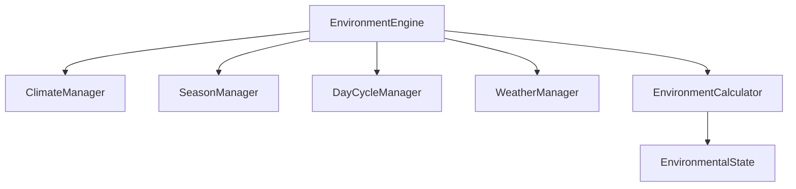

#### Calculation Flow
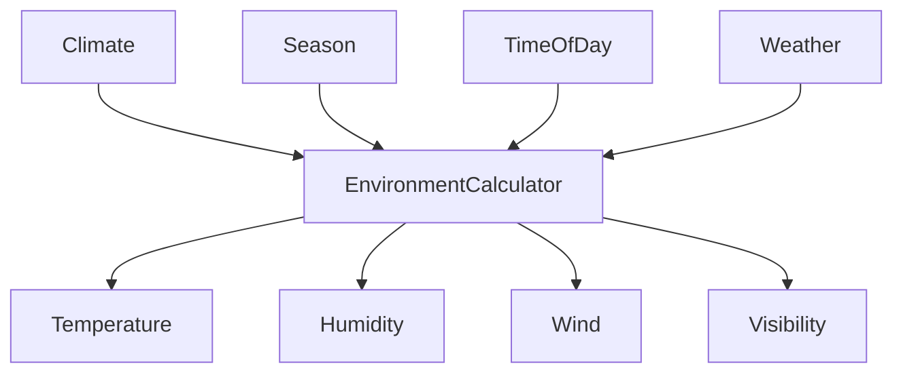

#### Spatial Coherence (Weather Propagation)
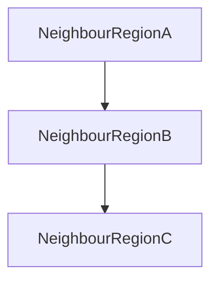

## Phase 2.3 – Resource Engine

The Resource Engine represents nature in Project Genesis. It is responsible for generating, storing, managing, regenerating, and monitoring every natural resource existing in the simulation world. Resources exist independently of civilization, and their generation is strictly deterministic based on the World Seed.

### Purpose
To provide a foundational, data-driven layer of natural resources (Water, Forests, Minerals, Energy Potentials) that future economic and citizen systems will interact with.

### Architecture
The Resource Engine is highly modular and integrates seamlessly with existing systems while remaining decoupled:
- **ResourceManager**: In-memory state store for all resources.
- **ResourceGenerator**: Deterministic generation algorithms seeded by the World Seed and Region factors.
- **ResourceCalculator**: Formulas for dynamic resource evolution based on environmental states.

### Generation Pipeline
Resource generation strictly follows a dependency chain ensuring absolute determinism:

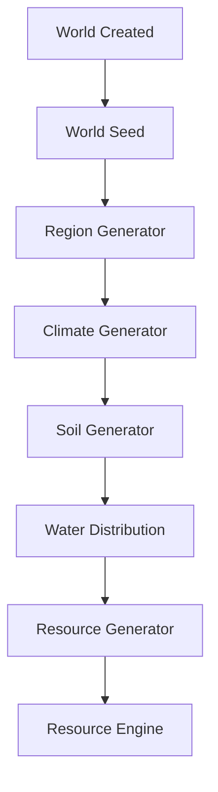

### Static vs Dynamic Factors
- **Static Factors**: Define the initial generation based purely on Region characteristics (Climate, Seed). E.g., Mountains have High Stone and Iron, Deserts have Low Water but High Solar Potential.
- **Dynamic Factors**: Modifies existing resources post-generation. Governed by Weather, Season, Temperature, and Humidity.

### Regeneration
- **Renewable Resources**: (Water, Forests, Wildlife, Fish) Regenerate over time driven by environmental inputs.
- **Non-Renewable Resources**: (Iron, Coal, Gold, Oil) Never regenerate.

### Environmental Interaction
The Resource Engine subscribes to the Event Scheduler and updates based on the authoritative Environmental state. Heavy rain increases river levels and forest growth, while heatwaves cause drought damage to biological resources.

#### Engine Integration
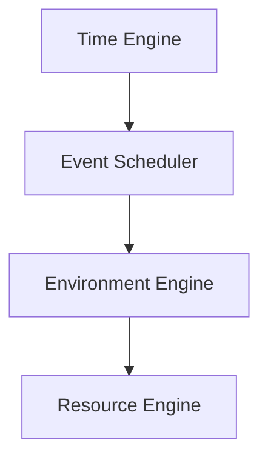

#### Regional Resource Model
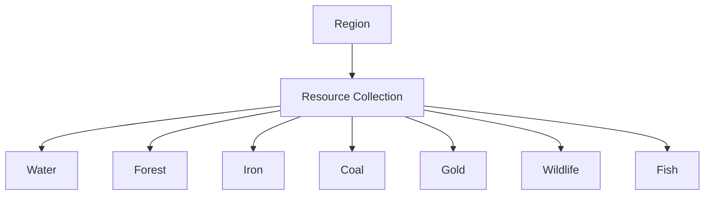

#### Dynamic Update Flow
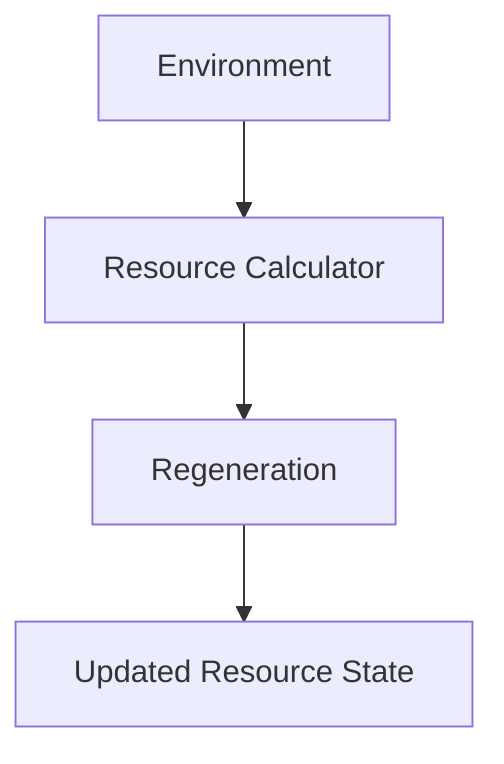

## Phase 2.4 – Spatial Engine

The Spatial Engine provides efficient spatial queries, indexing, and coordinate relationships over the world managed by the World Engine. It does not replace the World Engine's hierarchical ownership, but answers "How are these entities spatially related?" in a performant manner.

### Purpose
To serve high-performance spatial queries (e.g. `findNearby`, `findNearest`) avoiding O(N) entity scans across the entire simulation by utilizing a generic Spatial Index.

### Coordinate System
All entities in the World Engine use a 2D Cartesian coordinate system. The Spatial Engine uses deterministic Euclidean distance: `sqrt((x2 - x1)^2 + (y2 - y1)^2)`.

### Spatial Index (GridSpatialIndex)
A generic `SpatialIndex` interface abstracts the storage mechanism. The current implementation uses a **Spatial Hash Grid**, splitting the world into discrete cells. When a query is performed, only entities residing in intersecting cells are inspected, drastically improving performance.

### Entity Lifecycle and Event Integration
When entities are created, moved, or removed in the World Engine, the Spatial Engine reacts to update its index dynamically, ensuring stale data is purged.

### Engine Integration
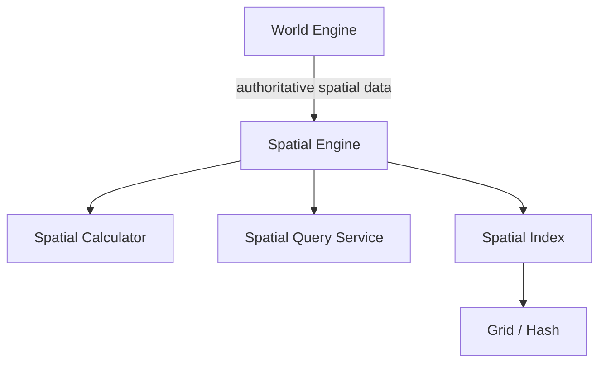

### Entity Lifecycle
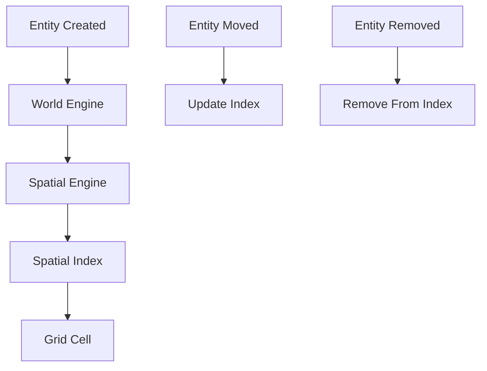

### Spatial Query Flow
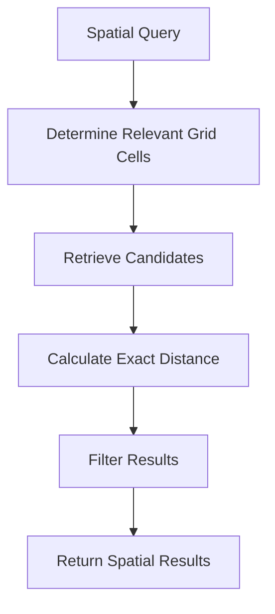

## Phase 2.5 — World Inspector

The World Inspector is a **Read-Only developer interface** designed to observe the live, deterministic state of the entire Genesis simulation. It acts as the ultimate debugging dashboard, aggregating data from all the backend engines into a single, unified view without introducing any simulation logic into the frontend.

### Purpose
To provide a data-first, visualization-second view of the simulation, ensuring the backend remains the authoritative source of truth.

### Key Features
- **World Overview**: Real-time simulation time, season, world seed, and entity counts.
- **Hierarchical World Tree**: Expandable mapping of Regions, Cities, Districts, and Buildings directly from the backend.
- **Entity Inspector**: Displays environmental data (climate, weather, temp), regional resources (capacity, quantity, regeneration rate), and spatial coordinates.
- **Engine Statuses**: Tracks the health, uptime, and queue states of Time, Events, World, Environment, Resource, and Spatial engines.
- **World Verification**: Calculates a deterministic SHA-256 hash derived purely from structural simulation data, guaranteeing seed-based reproducibility regardless of runtime constraints.

### Read-Only Architecture
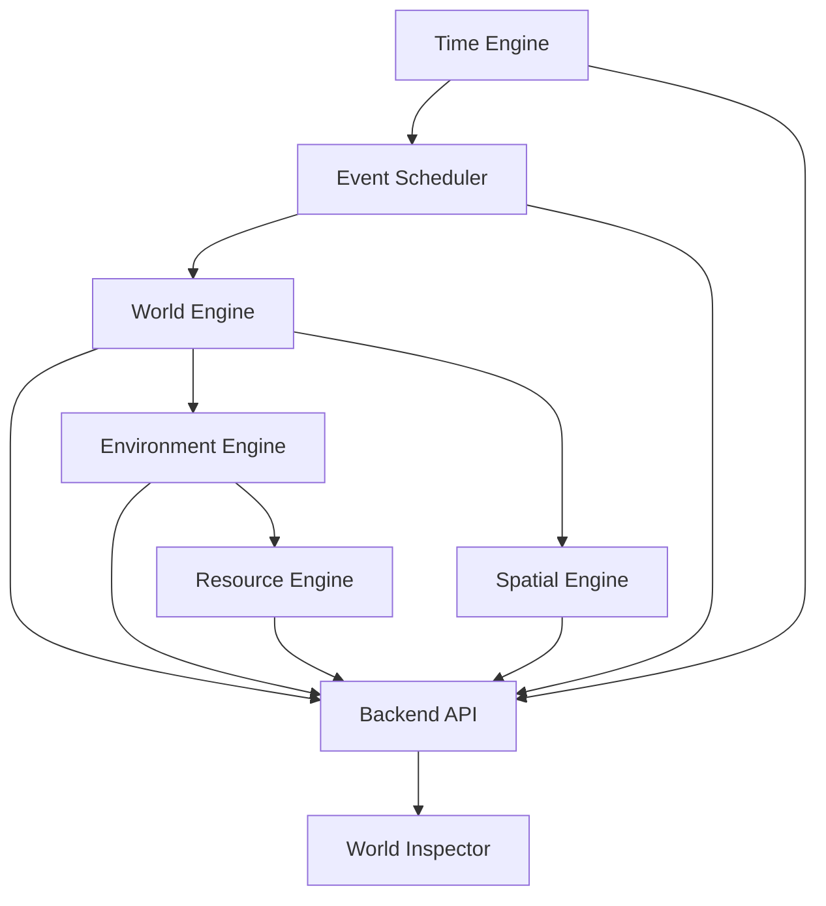

### State Aggregation
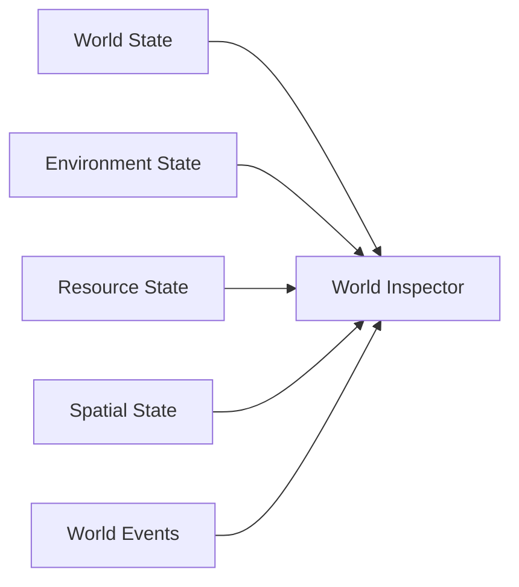

## Phase 3 — Citizen Engine

### Phase 3.1 — Citizen Model
Establishes the foundational deterministic Citizen Domain Model without adding behavior or AI simulation.

- **Purpose**: Define what a Citizen is and provide a clean representation for future systems.
- **Citizen Identity**: Generates unique, stable `citizen-000001` format IDs. Uses deterministic Name Generation powered by `SeededRandom`.
- **Location References**: The engine enforces separation from the World Engine by storing a reference (`locationId`) rather than duplicating spatial data. It explicitly rejects non-existent locations by validating against the authoritative World Engine.
- **Time Integration**: Uses the Time Engine's authoritative `SimulationClock`. Age is deterministically derived via `currentDate.year - birthDate.year` instead of using real-world `Date.now()`.
- **Repository Abstraction**: Includes a clean `CitizenRepository` abstraction with an `InMemoryCitizenRepository` implementation.

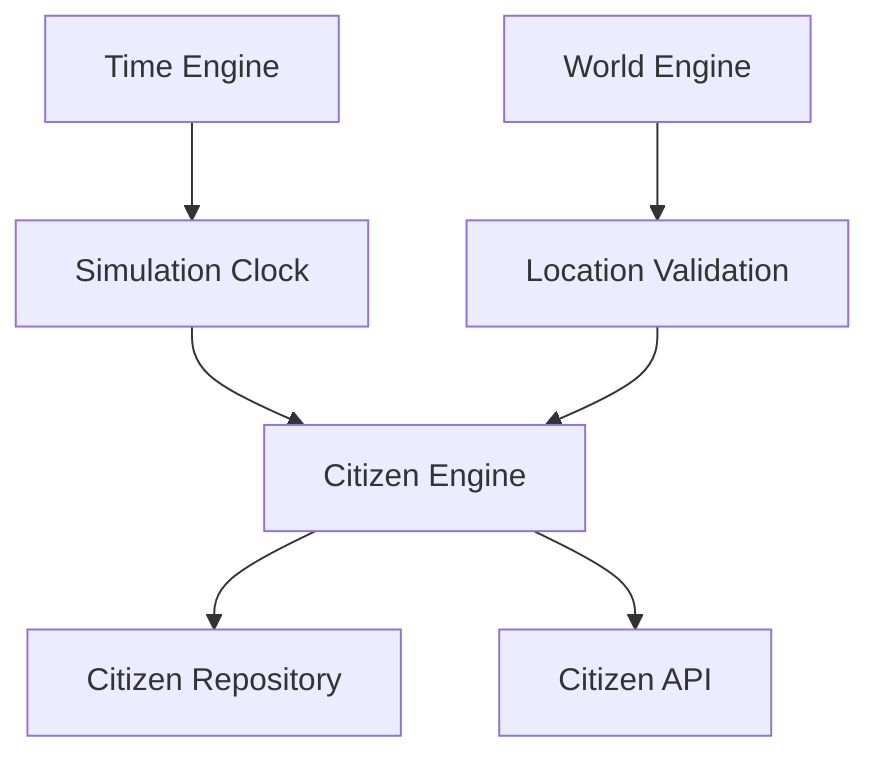

## Phase 3.3 — Needs & Vital State

The Needs & Vital State phase introduces the first dynamic biological state of citizens in Genesis. Each citizen now receives a `VitalState` tracking Hunger, Thirst, Energy, and Health values bounds strictly between 0 and 100.

### Responsibilities
- **Vital State Generation**: Deterministically initializes citizen vital states upon creation using the configured seed.
- **Needs Decay**: Dynamically increases hunger, increases thirst, and modifies energy based strictly on the elapsed Simulation Time between updates.
- **Separation of Concerns**: Health damage and starvation logic belong to future lifecycle modules. Needs Engine strictly manages numerical decay based on time.

### Architecture Rules
- Does **not** use real-world `Date.now()`. Needs decay according to `SimulationClock` time.
- Handles simulation pausing and varying speed gracefully by calculating deltas based on simulation hours elapsed since the last update.
- Scalable: Integrates with the existing `EventScheduler` to run a periodic (hourly) population update rather than spamming independent ticks for thousands of citizens.

### Future Integration
The Needs Engine is structurally ready to interface with the Resource Engine (Food/Water availability) and Environment Engine (Temperature modifiers) through abstractions.

### Engine Architecture

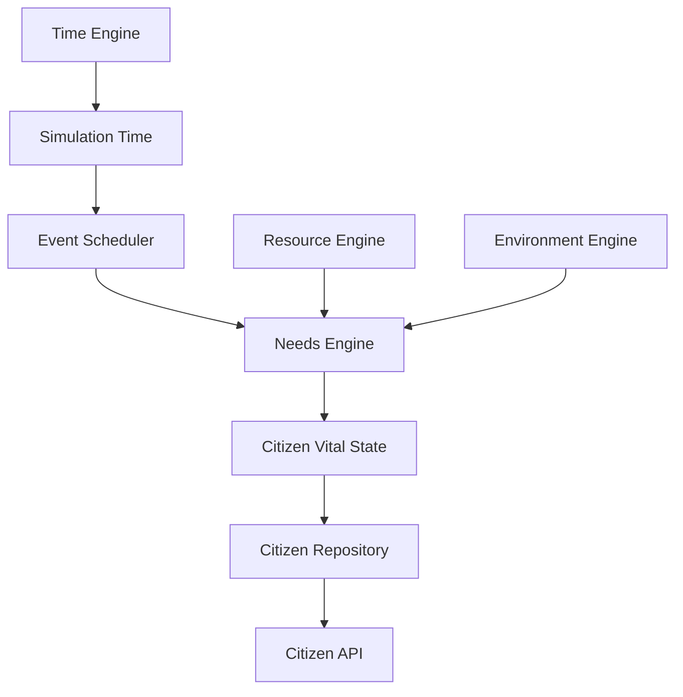

### Future Citizen Lifecycle Dependency

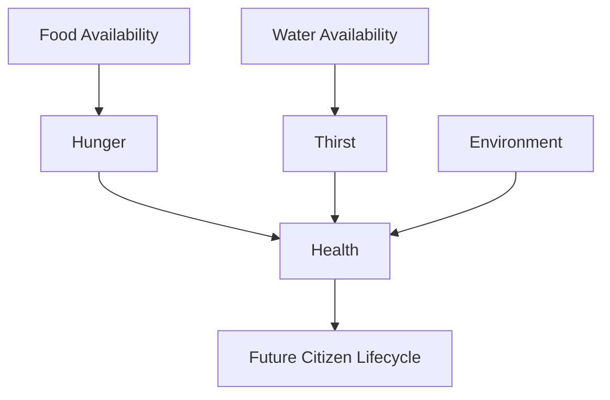