# Project Genesis

**Data first. Visualization second.**

Project Genesis is a modular simulation engine designed to power complex civilization simulations. This repository contains the complete foundational structure, utilizing a clean, scalable architecture independent of the frontend visualization.

## Project Vision

To build a highly decoupled, data-driven simulation engine where backend systems compute the state of the world, and any number of frontends can connect to visualize that state. This phase focuses entirely on establishing the robust monorepo architecture and foundational packages.

## Architecture

This project follows **Clean Architecture** principles:
- **Presentation:** Frontend React Application.
- **Application:** Use cases and orchestration (Backend Services).
- **Domain:** Core business rules (Shared Types/Models).
- **Infrastructure:** Databases, APIs, and External Services (Backend Repositories).

The simulation engine is completely independent from the frontend.

## Folder Structure

```
genesis/
├── packages/
│   └── engine/   # Core simulation engine logic (Time Engine, etc.)
├── frontend/     # React, Vite, Tailwind CSS application
├── backend/      # Node.js, Fastify, Prisma backend API
├── shared/       # Shared TypeScript types, interfaces, constants
├── docs/         # Additional project documentation
├── scripts/      # Automation and CI/CD scripts
└── .github/      # GitHub actions and workflows
```

## Tech Stack

### Frontend
- **Framework:** React + TypeScript + Vite
- **Styling:** Tailwind CSS + shadcn/ui
- **State/Routing:** Zustand, React Router, TanStack Query

### Backend
- **Framework:** Node.js + Fastify + TypeScript
- **Database:** Prisma ORM + SQLite
- **Validation:** Zod
- **Config:** dotenv

### Shared
- **Tooling:** ESLint, Prettier, Husky, lint-staged

## Installation

1. Install dependencies from the root to bootstrap all workspaces:
   ```bash
   npm install
   ```
2. Generate the Prisma Client:
   ```bash
   cd backend
   npx prisma generate
   ```

## Running the Project

### Running Backend
```bash
npm run dev:backend
```
*Runs the Fastify server with hot-reload.*

### Running Frontend
```bash
npm run dev:frontend
```
*Runs the Vite development server.*

### Running Both
```bash
npm run dev
```

## Current Phase Status (Phase 1.2)
- **Completed:** Foundation monorepo structure.
- **Completed:** Time Engine module (`packages/engine`) decoupled from frontend and backend.
- **Completed:** Backend REST API mapping to Time Engine.
- **Completed:** Frontend React Dashboard visualization of Time Engine.

## Future Roadmap

```text
Genesis Roadmap

Phase 1 ✅ Core Engine
├── Project Foundation
├── Time Engine
├── Event Scheduler
└── Engine Inspector

Phase 2 🚧 World Engine
├── 2.1 World Model
├── 2.2 Environment Engine
├── 2.3 Resource Engine
├── 2.4 Spatial Engine
└── 2.5 World Inspector

Phase 3 🔜 Citizen Engine
Phase 4 🔜 AI Decision Engine
Phase 5 🔜 Economy Engine
Phase 6 🔜 Relationship Engine
Phase 7 🔜 History Engine
Phase 8 🔜 Visualization
Phase 9 🔜 Persistence
Phase 10 🔜 Optimization & Scale
```

## Phase 2 – World Engine

The World Engine provides the spatial foundation for every future module in Project Genesis. 

### Responsibilities
- Manages the hierarchical spatial structure of the simulation world.
- Serves as the authoritative source for the location of all simulated entities.
- Provides high-performance spatial queries (e.g. `findNearbyBuildings`, `findNearestEntity`).

### Hierarchy & Spatial Model
The simulation environment is organized into a strictly parented tree structure:
`World` -> `Region` -> `City` -> `District` -> `Building` -> `Room` -> `Object`

Every spatial entity maintains a 2D Cartesian `Coordinate (x, y)` to allow euclidean distance calculations and pathfinding.

### Future Integration
All future engines (Citizen, Weather, Economy, Transportation, AI) will depend on the World Engine to situate their domain entities and resolve spatial interactions.

### Overall Genesis Architecture

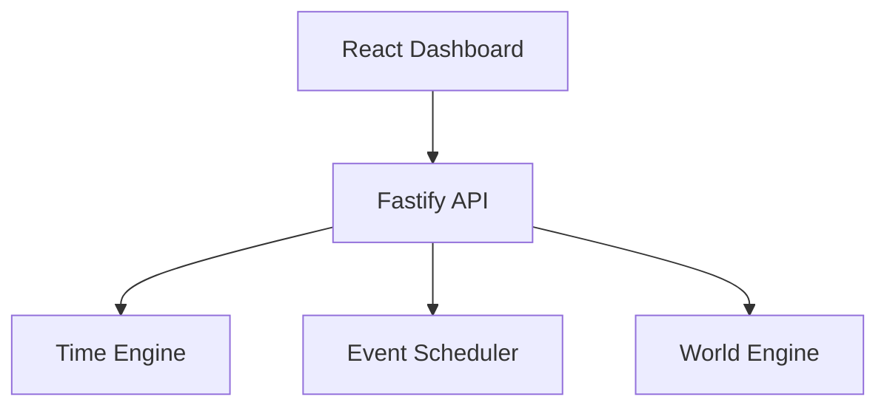
```mermaid
flowchart TD

Dashboard[React Dashboard]
API[Fastify API]
Time[Time Engine]
Scheduler[Event Scheduler]
World[World Engine]

Dashboard --> API
API --> Time
API --> Scheduler
API --> World
```
## World Initialization

Genesis does not automatically create a simulation world.

On first startup:

1. No active world exists.
2. GET /api/v1/world returns **404 No Active World**.
3. The frontend displays a "Create World" state.
4. The developer creates the world using:

POST /api/v1/world

After creation, the World Engine becomes active and all future modules operate within this world.

This design ensures the simulation lifecycle is explicit and controlled by the engine rather than hidden initialization logic.

## Phase 2.2 – Environment Engine

The Environment Engine adds a robust, data-driven environmental simulation layer to Genesis. It is responsible for simulating realistic environmental conditions across the world's regions independently from other engines.

### Architecture
The Environment Engine comprises independent modules to maintain separation of responsibilities:
- **Climate Manager**: Stores Region "DNA" (Tropical, Temperate, etc.)
- **Season Manager**: Dictates seasons (Spring, Summer, Autumn, Winter) mapped to the Genesis calendar.
- **Day Cycle Manager**: Translates time into day phases (Dawn, Morning, Afternoon, Evening, Night).
- **Weather Manager**: Handles localized weather transitions using weighted probabilities and Markov chains.
- **Environment Calculator**: Dynamically calculates granular values (Temperature, Humidity, Wind, Visibility) based on base climate, season, day phase, weather, and noise.

### Event Integration
The Environment Engine avoids tight polling. Instead, it subscribes to the Event Scheduler (using a recurring hourly event) to update states and emits standard `SimulationEvent`s when seasons, weather, or day phases transition (e.g., Sunrise, Sunset, Season Change).

### Weather Fronts and Spatial Coherence
Adjacent regions influence each other. A storm in one region can bleed into a neighboring sunny region, creating realistic weather fronts moving across the world without relying on pure randomness.

### Mermaid Diagrams

#### Engine Integration
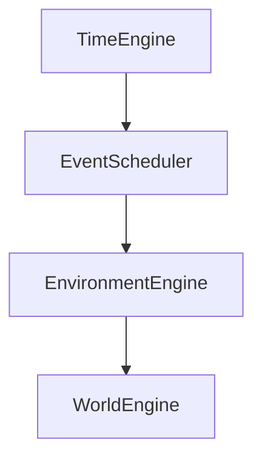
```mermaid
graph TD;
    TimeEngine --> EventScheduler;
    EventScheduler --> EnvironmentEngine;
    EnvironmentEngine --> WorldEngine;
```

#### Environment Engine Architecture
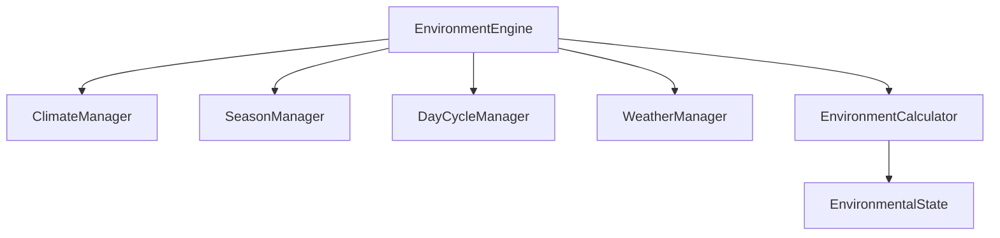
```mermaid
graph TD;
    EnvironmentEngine --> ClimateManager;
    EnvironmentEngine --> SeasonManager;
    EnvironmentEngine --> DayCycleManager;
    EnvironmentEngine --> WeatherManager;
    EnvironmentEngine --> EnvironmentCalculator;
    EnvironmentCalculator --> EnvironmentalState;
```

#### Calculation Flow
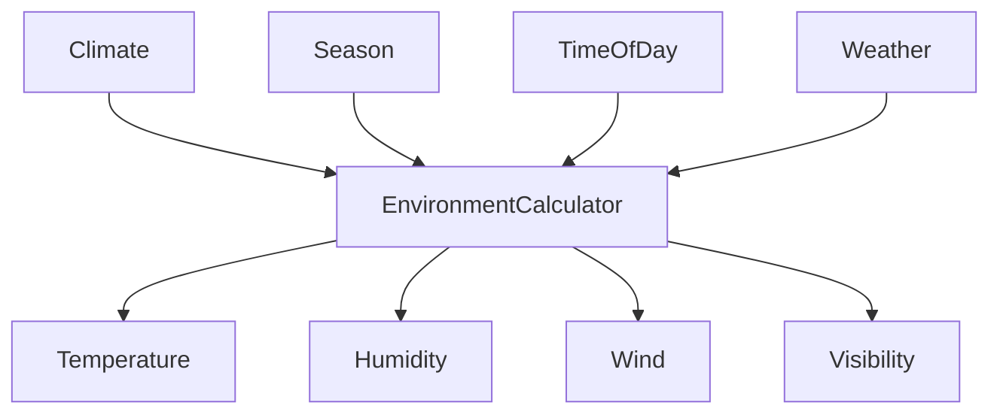
```mermaid
graph TD;
    Climate --> EnvironmentCalculator;
    Season --> EnvironmentCalculator;
    TimeOfDay --> EnvironmentCalculator;
    Weather --> EnvironmentCalculator;
    EnvironmentCalculator --> Temperature;
    EnvironmentCalculator --> Humidity;
    EnvironmentCalculator --> Wind;
    EnvironmentCalculator --> Visibility;
```

#### Spatial Coherence (Weather Propagation)
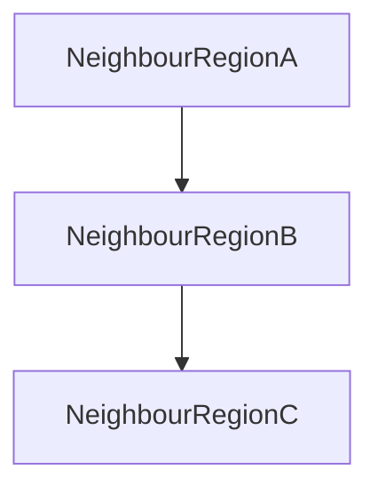
```mermaid
graph TD;
    NeighbourRegionA --> NeighbourRegionB;
    NeighbourRegionB --> NeighbourRegionC;
```

## Phase 2.3 – Resource Engine

The Resource Engine represents nature in Project Genesis. It is responsible for generating, storing, managing, regenerating, and monitoring every natural resource existing in the simulation world. Resources exist independently of civilization, and their generation is strictly deterministic based on the World Seed.

### Purpose
To provide a foundational, data-driven layer of natural resources (Water, Forests, Minerals, Energy Potentials) that future economic and citizen systems will interact with.

### Architecture
The Resource Engine is highly modular and integrates seamlessly with existing systems while remaining decoupled:
- **ResourceManager**: In-memory state store for all resources.
- **ResourceGenerator**: Deterministic generation algorithms seeded by the World Seed and Region factors.
- **ResourceCalculator**: Formulas for dynamic resource evolution based on environmental states.

### Generation Pipeline
Resource generation strictly follows a dependency chain ensuring absolute determinism:

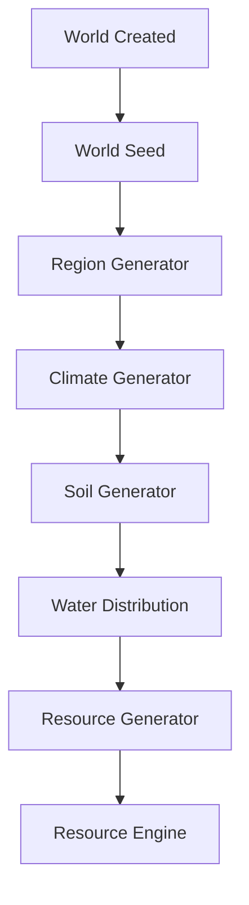
```mermaid
graph TD;
    WorldCreated[World Created] --> WorldSeed[World Seed]
    WorldSeed --> RegionGenerator[Region Generator]
    RegionGenerator --> ClimateGenerator[Climate Generator]
    ClimateGenerator --> SoilGenerator[Soil Generator]
    SoilGenerator --> WaterDistribution[Water Distribution]
    WaterDistribution --> ResourceGenerator[Resource Generator]
    ResourceGenerator --> ResourceEngine[Resource Engine]
```

### Static vs Dynamic Factors
- **Static Factors**: Define the initial generation based purely on Region characteristics (Climate, Seed). E.g., Mountains have High Stone and Iron, Deserts have Low Water but High Solar Potential.
- **Dynamic Factors**: Modifies existing resources post-generation. Governed by Weather, Season, Temperature, and Humidity.

### Regeneration
- **Renewable Resources**: (Water, Forests, Wildlife, Fish) Regenerate over time driven by environmental inputs.
- **Non-Renewable Resources**: (Iron, Coal, Gold, Oil) Never regenerate.

### Environmental Interaction
The Resource Engine subscribes to the Event Scheduler and updates based on the authoritative Environmental state. Heavy rain increases river levels and forest growth, while heatwaves cause drought damage to biological resources.

#### Engine Integration
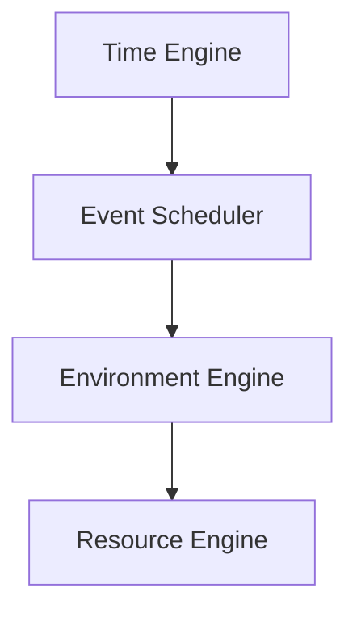
```mermaid
graph TD;
    TimeEngine[Time Engine] --> EventScheduler[Event Scheduler]
    EventScheduler --> EnvironmentEngine[Environment Engine]
    EnvironmentEngine --> ResourceEngine[Resource Engine]
```

#### Regional Resource Model
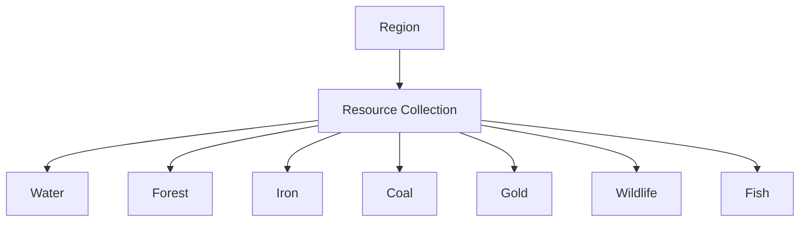
```mermaid
graph TD;
    Region[Region] --> ResourceCollection[Resource Collection]
    ResourceCollection --> Water[Water]
    ResourceCollection --> Forest[Forest]
    ResourceCollection --> Iron[Iron]
    ResourceCollection --> Coal[Coal]
    ResourceCollection --> Gold[Gold]
    ResourceCollection --> Wildlife[Wildlife]
    ResourceCollection --> Fish[Fish]
```

#### Dynamic Update Flow
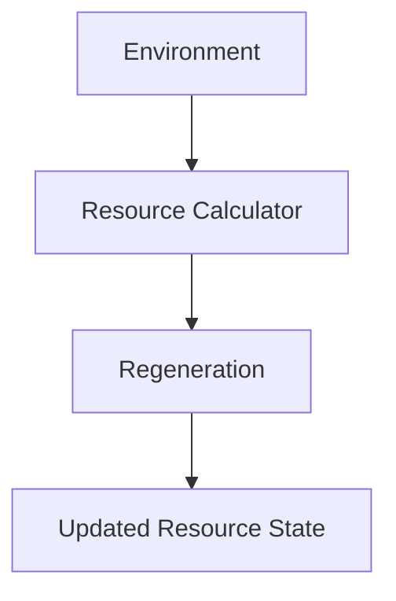
```mermaid
graph TD;
    Environment[Environment] --> ResourceCalculator[Resource Calculator]
    ResourceCalculator --> Regeneration[Regeneration]
    Regeneration --> UpdatedState[Updated Resource State]
```

## Phase 2.4 – Spatial Engine

The Spatial Engine provides efficient spatial queries, indexing, and coordinate relationships over the world managed by the World Engine. It does not replace the World Engine's hierarchical ownership, but answers "How are these entities spatially related?" in a performant manner.

### Purpose
To serve high-performance spatial queries (e.g. `findNearby`, `findNearest`) avoiding O(N) entity scans across the entire simulation by utilizing a generic Spatial Index.

### Coordinate System
All entities in the World Engine use a 2D Cartesian coordinate system. The Spatial Engine uses deterministic Euclidean distance: `sqrt((x2 - x1)^2 + (y2 - y1)^2)`.

### Spatial Index (GridSpatialIndex)
A generic `SpatialIndex` interface abstracts the storage mechanism. The current implementation uses a **Spatial Hash Grid**, splitting the world into discrete cells. When a query is performed, only entities residing in intersecting cells are inspected, drastically improving performance.

### Entity Lifecycle and Event Integration
When entities are created, moved, or removed in the World Engine, the Spatial Engine reacts to update its index dynamically, ensuring stale data is purged.

### Engine Integration
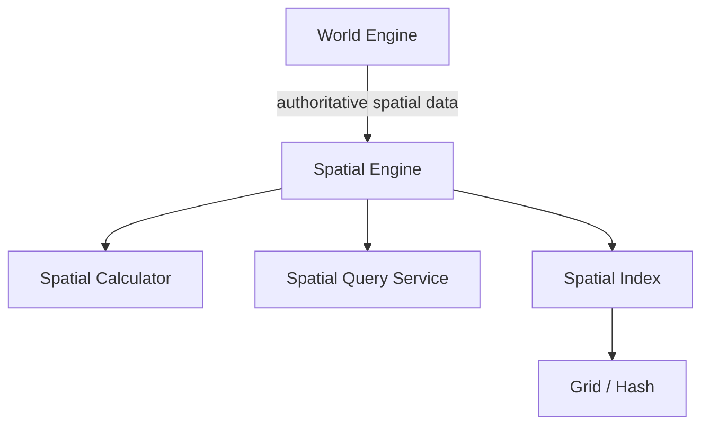
```mermaid
graph TD;
    WorldEngine[World Engine] -->|authoritative spatial data| SpatialEngine[Spatial Engine]
    SpatialEngine --> SpatialCalculator[Spatial Calculator]
    SpatialEngine --> SpatialQueryService[Spatial Query Service]
    SpatialEngine --> SpatialIndex[Spatial Index]
    SpatialIndex --> GridHash[Grid / Hash]
```

### Entity Lifecycle
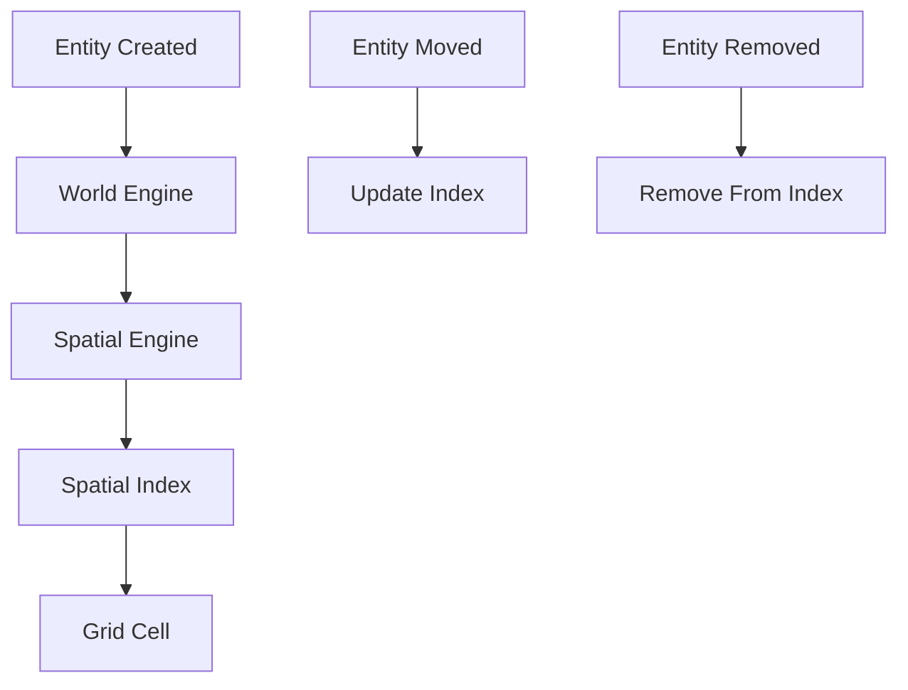
```mermaid
graph TD;
    EntityCreated[Entity Created] --> WorldEngine[World Engine]
    WorldEngine --> SpatialEngine[Spatial Engine]
    SpatialEngine --> SpatialIndex[Spatial Index]
    SpatialIndex --> GridCell[Grid Cell]
    
    EntityMoved[Entity Moved] --> UpdateIndex[Update Index]
    EntityRemoved[Entity Removed] --> RemoveFromIndex[Remove From Index]
```

### Spatial Query Flow
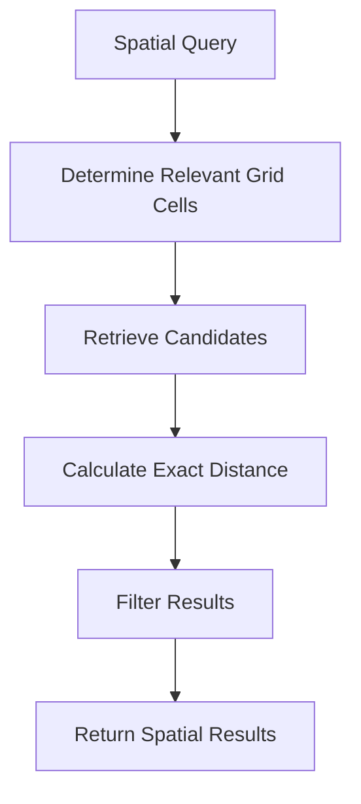
```mermaid
graph TD;
    SpatialQuery[Spatial Query] --> DetermineCells[Determine Relevant Grid Cells]
    DetermineCells --> RetrieveCandidates[Retrieve Candidates]
    RetrieveCandidates --> CalculateExactDistance[Calculate Exact Distance]
    CalculateExactDistance --> FilterResults[Filter Results]
    FilterResults --> ReturnResults[Return Spatial Results]
```

## Phase 2.5 — World Inspector

The World Inspector is a **Read-Only developer interface** designed to observe the live, deterministic state of the entire Genesis simulation. It acts as the ultimate debugging dashboard, aggregating data from all the backend engines into a single, unified view without introducing any simulation logic into the frontend.

### Purpose
To provide a data-first, visualization-second view of the simulation, ensuring the backend remains the authoritative source of truth.

### Key Features
- **World Overview**: Real-time simulation time, season, world seed, and entity counts.
- **Hierarchical World Tree**: Expandable mapping of Regions, Cities, Districts, and Buildings directly from the backend.
- **Entity Inspector**: Displays environmental data (climate, weather, temp), regional resources (capacity, quantity, regeneration rate), and spatial coordinates.
- **Engine Statuses**: Tracks the health, uptime, and queue states of Time, Events, World, Environment, Resource, and Spatial engines.
- **World Verification**: Calculates a deterministic SHA-256 hash derived purely from structural simulation data, guaranteeing seed-based reproducibility regardless of runtime constraints.

### Read-Only Architecture
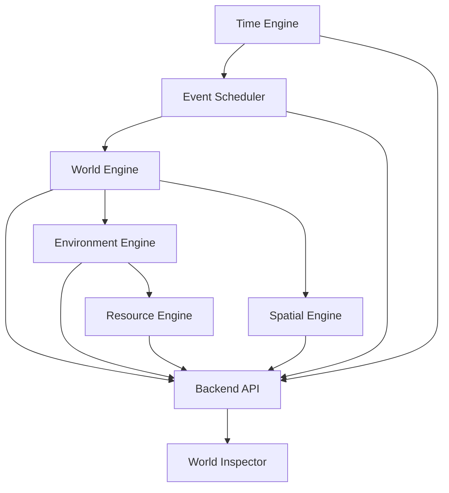
```mermaid
flowchart TD

    Time[Time Engine]
    Events[Event Scheduler]
    World[World Engine]
    Environment[Environment Engine]
    Resources[Resource Engine]
    Spatial[Spatial Engine]
    API[Backend API]
    Inspector[World Inspector]

    Time --> Events
    Events --> World
    World --> Environment
    Environment --> Resources
    World --> Spatial

    World --> API
    Environment --> API
    Resources --> API
    Spatial --> API
    Events --> API
    Time --> API

    API --> Inspector
```

### State Aggregation
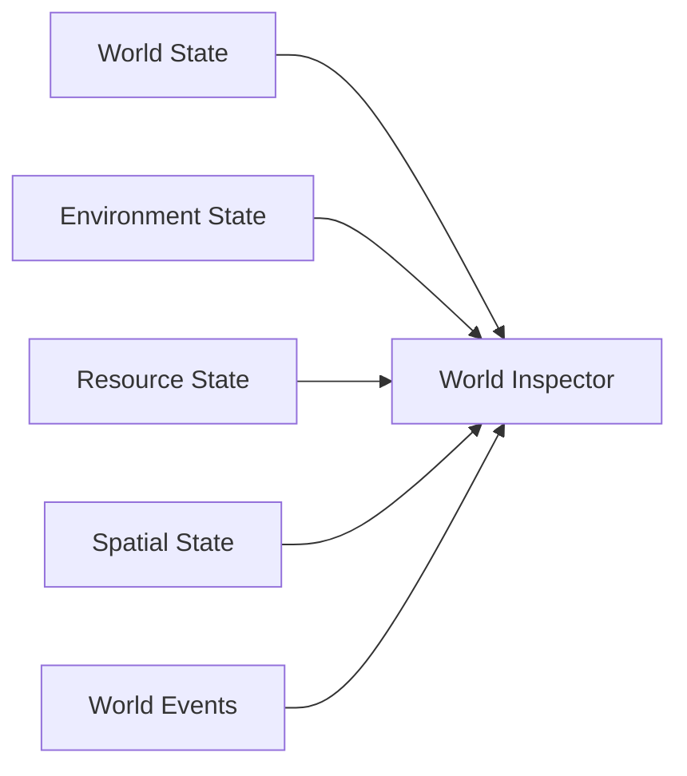
```mermaid
flowchart LR

    World[World State]
    Environment[Environment State]
    Resources[Resource State]
    Spatial[Spatial State]
    Events[World Events]

    World --> Inspector[World Inspector]
    Environment --> Inspector
    Resources --> Inspector
    Spatial --> Inspector
    Events --> Inspector
```

## Phase 3 — Citizen Engine

### Phase 3.1 — Citizen Model
Establishes the foundational deterministic Citizen Domain Model without adding behavior or AI simulation.

- **Purpose**: Define what a Citizen is and provide a clean representation for future systems.
- **Citizen Identity**: Generates unique, stable `citizen-000001` format IDs. Uses deterministic Name Generation powered by `SeededRandom`.
- **Location References**: The engine enforces separation from the World Engine by storing a reference (`locationId`) rather than duplicating spatial data. It explicitly rejects non-existent locations by validating against the authoritative World Engine.
- **Time Integration**: Uses the Time Engine's authoritative `SimulationClock`. Age is deterministically derived via `currentDate.year - birthDate.year` instead of using real-world `Date.now()`.
- **Repository Abstraction**: Includes a clean `CitizenRepository` abstraction with an `InMemoryCitizenRepository` implementation.

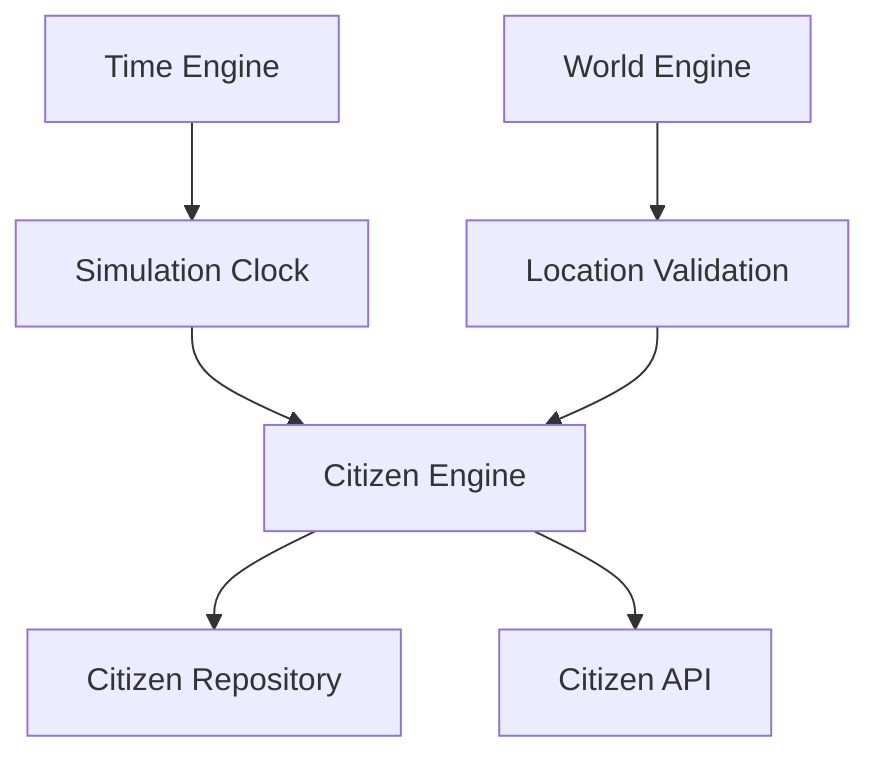
```mermaid
flowchart TD
    Time[Time Engine] --> Clock[Simulation Clock]
    World[World Engine] --> Location[Location Validation]
    Clock --> Citizen[Citizen Engine]
    Location --> Citizen
    Citizen --> Repository[Citizen Repository]
    Citizen --> API[Citizen API]
```

## Phase 3.3 — Needs & Vital State

The Needs & Vital State phase introduces the first dynamic biological state of citizens in Genesis. Each citizen now receives a `VitalState` tracking Hunger, Thirst, Energy, and Health values bounds strictly between 0 and 100.

### Responsibilities
- **Vital State Generation**: Deterministically initializes citizen vital states upon creation using the configured seed.
- **Needs Decay**: Dynamically increases hunger, increases thirst, and modifies energy based strictly on the elapsed Simulation Time between updates.
- **Separation of Concerns**: Health damage and starvation logic belong to future lifecycle modules. Needs Engine strictly manages numerical decay based on time.

### Architecture Rules
- Does **not** use real-world `Date.now()`. Needs decay according to `SimulationClock` time.
- Handles simulation pausing and varying speed gracefully by calculating deltas based on simulation hours elapsed since the last update.
- Scalable: Integrates with the existing `EventScheduler` to run a periodic (hourly) population update rather than spamming independent ticks for thousands of citizens.

### Future Integration
The Needs Engine is structurally ready to interface with the Resource Engine (Food/Water availability) and Environment Engine (Temperature modifiers) through abstractions.

### Engine Architecture

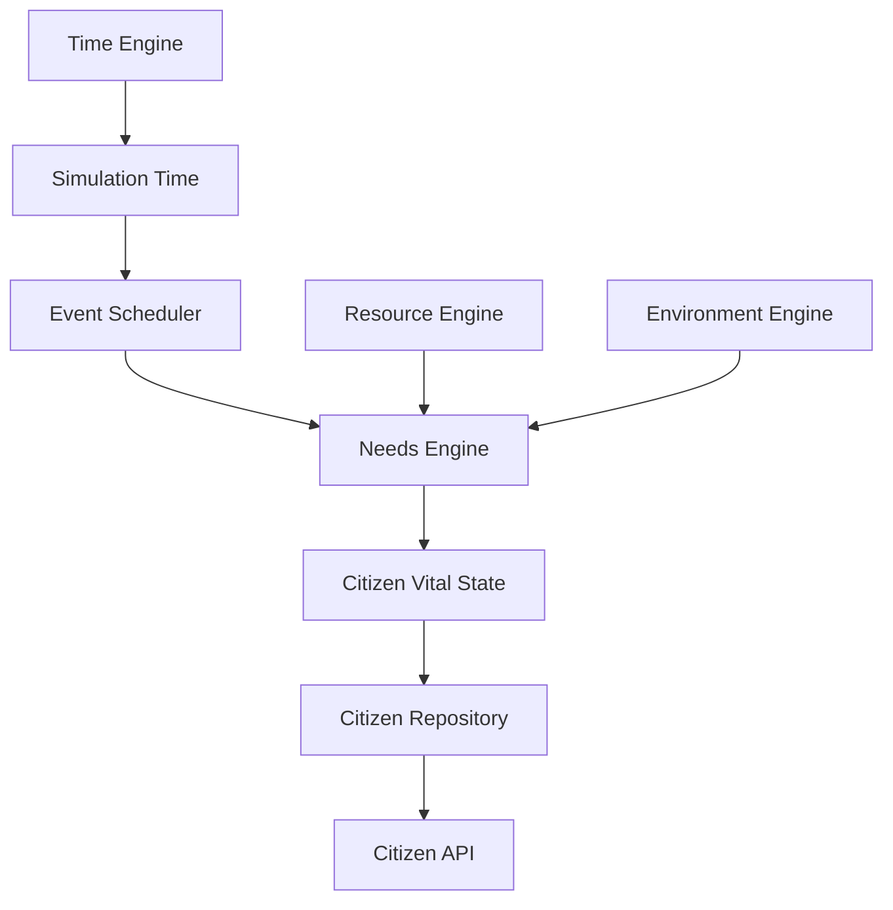
```mermaid
flowchart TD

    Time[Time Engine]
        --> Clock[Simulation Time]

    Clock
        --> Scheduler[Event Scheduler]

    Scheduler
        --> Needs[Needs Engine]

    Needs
        --> Citizens[Citizen Vital State]

    Resources[Resource Engine]
        --> Needs

    Environment[Environment Engine]
        --> Needs

    Citizens
        --> Repository[Citizen Repository]

    Repository
        --> API[Citizen API]
```

### Future Citizen Lifecycle Dependency

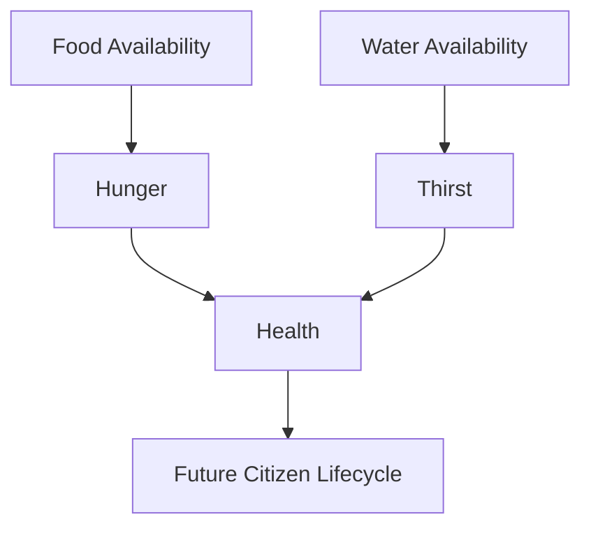
```mermaid
flowchart TD

    Food[Food Availability]
        --> Hunger[Hunger]

    Water[Water Availability]
        --> Thirst[Thirst]

    Hunger
        --> Health[Health]

    Thirst
        --> Health

    Health
        --> Lifecycle[Future Citizen Lifecycle]
```

## Resource Model

The Resource Engine strictly defines semantic, deterministic data rather than arbitrary scores.

- **Resource Categories**: Resources are divided into `RENEWABLE` (e.g., Water, Forests) and `NON_RENEWABLE` (e.g., Minerals).
- **Physical Units**: Every resource has a defined physical unit (`m³`, `ha`, `tonnes`, etc.) for absolute clarity.
- **Current Quantity & Capacity**: The engine explicitly limits `currentAmount` to `maximumAmount`, with maximum capacity derived deterministically from region characteristics (climate, size).
- **Natural Recovery**: Renewable resources have a `naturalRecoveryRate` (amount replenished per hour). Non-renewable resources are explicitly marked with `null`.
- **Condition**: Replaces generic "Health" and "Quality" with explicit, semantic strings like `Water Quality`, `Forest Condition`, or `Ore Purity`.
- **Deterministic Generation**: All generation uses a `SeededRandom` dependent on the global world seed and the specific region hash.
- **Consumption**: The API explicitly communicates `consumptionRate`, rendering it as `Not yet simulated` until consumption systems are built.

### Resource Engine Architecture

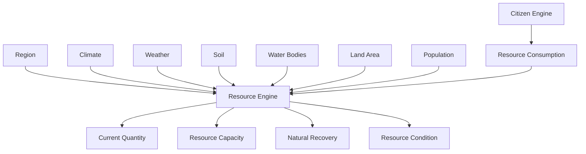
```mermaid
flowchart TD

    Region[Region]
    Climate[Climate]
    Weather[Weather]
    Soil[Soil]
    WaterBodies[Water Bodies]
    Land[Land Area]
    Population[Population]

    Region --> ResourceEngine[Resource Engine]
    Climate --> ResourceEngine
    Weather --> ResourceEngine
    Soil --> ResourceEngine
    WaterBodies --> ResourceEngine
    Land --> ResourceEngine
    Population --> ResourceEngine

    ResourceEngine --> Quantity[Current Quantity]
    ResourceEngine --> Capacity[Resource Capacity]
    ResourceEngine --> Recovery[Natural Recovery]
    ResourceEngine --> Condition[Resource Condition]

    CitizenEngine[Citizen Engine]
        --> Consumption[Resource Consumption]

    Consumption --> ResourceEngine
```

## Phase 3.4 — Location, Routes & Movement

Phase 3.4 introduces the mechanical movement infrastructure for citizens, strictly separating **movement execution** from **movement decision-making**.

### Responsibilities
- **Spatial Validation:** Resolves location IDs to their exact Euclidean coordinates using the World Engine's spatial hierarchies.
- **Route Generation:** Deterministically generates routes and estimated travel durations based on a configurable travel speed.
- **State Management:** Manages the active `MovementState` of citizens (`IDLE` vs `TRAVELLING`) and their active route context.
- **Event-Driven Arrival:** Uses the `EventScheduler` to schedule an arrival event at the expected completion time. Once the event triggers, the citizen's location is atomically updated and they are marked as `IDLE`.

### Movement Flow Architecture

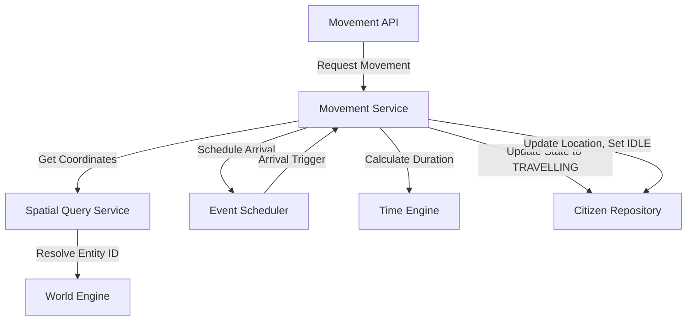
```mermaid
flowchart TD
    API[Movement API]
    Movement[Movement Service]
    Spatial[Spatial Query Service]
    World[World Engine]
    Events[Event Scheduler]
    Time[Time Engine]
    Citizen[Citizen Repository]

    API -->|Request Movement| Movement
    Movement -->|Get Coordinates| Spatial
    Spatial -->|Resolve Entity ID| World
    Movement -->|Calculate Duration| Time
    Movement -->|Schedule Arrival| Events
    Movement -->|Update State to TRAVELLING| Citizen

    Events -->|Arrival Trigger| Movement
    Movement -->|Update Location, Set IDLE| Citizen
```

### Determinism and Simulation Speed
Movement respects simulation pausing and dynamic simulation speeds, because the entire system calculates expected arrival in `SimulationTime` terms and integrates with the authoritative Time Engine through the Event Scheduler.

## Phase 3.5 — Occupation, Skills & Workplaces

Phase 3.5 gives citizens an economic and occupational identity. The engine assigns citizens to deterministic, resource-driven workplaces while adhering to strict requirements on skill suitability and age restrictions.

### Responsibilities
- **Skill System:** Citizens are deterministically generated with a set of 0–100 skills depending on their age and seed. 
- **World-Driven Generation:** Workplaces (Farms, Mines, Offices, Public Services) spawn organically based on the world's regions, existing structures (e.g., city buildings), and natural environment rather than randomized assignment.
- **Job Eligibility & Vacancies:** Jobs are strictly distributed based on workplace capacity (`vacancies = capacity - occupiedPositions`), citizen age (under 18 are `STUDENT`, 75+ are `RETIRED`), and required minimum skills.
- **Suitability Ranking:** Unemployed citizens are ranked for vacancies based on skill alignment, resolving tie-breakers deterministically.
- **Work Schedules:** Jobs have intrinsic start and end times, laying the foundation for future routine systems.

### Overall Occupation Architecture

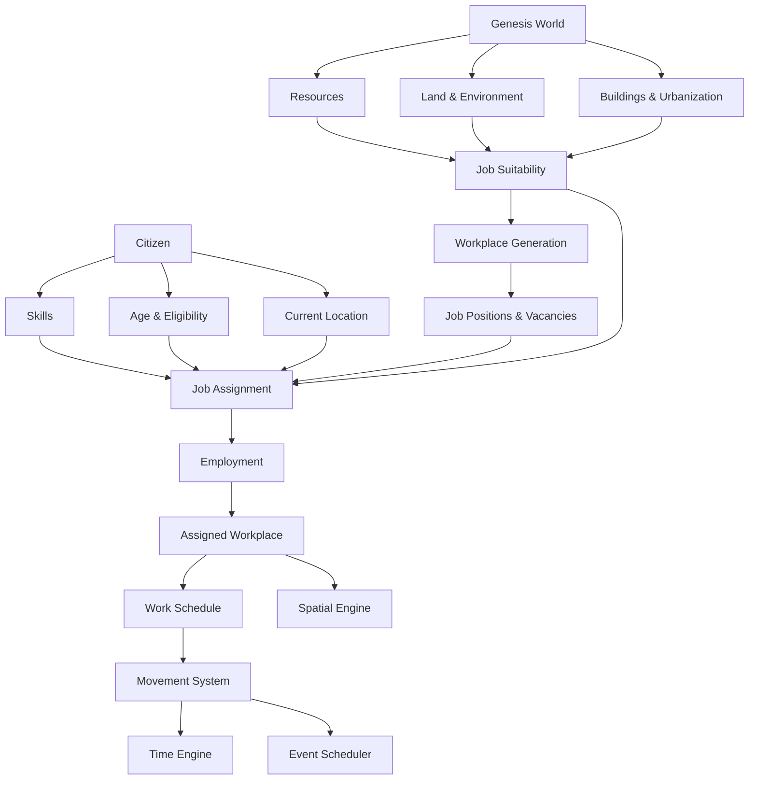
```mermaid
flowchart TD

    World[Genesis World]

    World --> Resources[Resources]
    World --> Land[Land & Environment]
    World --> Buildings[Buildings & Urbanization]

    Resources --> Suitability[Job Suitability]
    Land --> Suitability
    Buildings --> Suitability

    Suitability --> Workplaces[Workplace Generation]

    Workplaces --> Positions[Job Positions & Vacancies]

    Citizen[Citizen] --> Skills[Skills]
    Citizen --> Age[Age & Eligibility]
    Citizen --> Location[Current Location]

    Skills --> Assignment[Job Assignment]
    Age --> Assignment
    Location --> Assignment
    Positions --> Assignment
    Suitability --> Assignment

    Assignment --> Employment[Employment]

    Employment --> Workplace[Assigned Workplace]
    Workplace --> Schedule[Work Schedule]

    Workplace --> Spatial[Spatial Engine]
    Schedule --> Movement[Movement System]

    Movement --> Time[Time Engine]
    Movement --> Scheduler[Event Scheduler]
```

## Phase 4 — AI Decision Engine

The AI Decision Engine provides the foundational framework for citizen intelligence. It strictly separates **decision-making** from **execution**, orchestrating the sequence of perceiving state, scoring options, and finalizing a choice.

### Responsibilities
- **Decision Framework:** Abstractions for \DecisionContext\, \Decision\, and \Action\ represent what a citizen perceives, evaluates, and selects.
- **Scoring:** The engine delegates to a \DecisionEvaluator\ that deterministically produces a \[0, 100]\ score for candidate actions (e.g., \EAT\, \GO_TO_WORK\, \REST\).
- **Selection:** A \DecisionSelector\ selects the highest-scoring action and resolves ties deterministically.
- **Determinism:** The pipeline mathematically maps context inputs to final decisions without randomness, ensuring simulation consistency.
- **Event-Driven & Fallback Decisions:** Citizens evaluate actions triggered by specific events (like needs crossing a threshold or schedules starting) or via periodic fallback checks.
- **Action Execution Boundary:** The chosen \Decision\ is passed to an \ActionExecutor\, cleanly handing off side-effects to other engines (Movement, Future Economy).
- **Decision History:** A bounded \DecisionRecord\ log retains recent choices per citizen for inspection and debugging.

### Future Extensibility
The Decision Engine is explicitly architected to support future additions without major rewrites:
- **Personality Traits:** Traits will modify the \DecisionEvaluator\ logic to prefer certain actions.
- **Socioeconomic State:** Wealth and class context will be ingested via the \DecisionContext\.

### Decision Architecture

\\\mermaid
flowchart TD

    Citizen[Citizen Engine]
    World[World Engine]
    Environment[Environment Engine]
    Resources[Resource Engine]
    Spatial[Spatial Engine]
    Time[Time Engine]
    Scheduler[Event Scheduler]

    Citizen --> Context[Decision Context]
    World --> Context
    Environment --> Context
    Resources --> Context
    Spatial --> Context
    Time --> Context

    Scheduler --> Trigger[Decision Trigger]

    Context --> Evaluator[Decision Evaluator]
    Trigger --> Evaluator

    Evaluator --> Scoring[0-100 Scoring]
    Scoring --> Selector[Decision Selector]

    Selector --> Decision[Selected Decision]

    Decision --> Executor[Action Executor]

    Executor --> Movement[Movement Engine]
    Executor --> CitizenState[Citizen State]
    Executor --> FutureSystems[Future Economy / Food / Healthcare]

    Decision --> History[Decision History]
\\\

